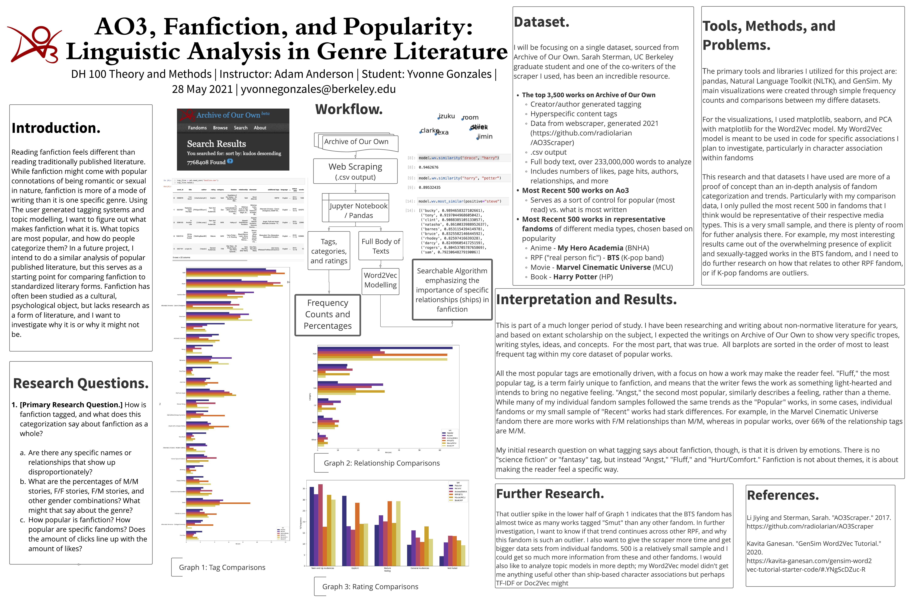

# Fandom Categorization and Genre Writing

#### Yvonne Gonzales
#### Course: Digital Humanities 100 and 101; Summer 2021
#### Instructors: Adam Anderson and Brooks Jessup

I am a senior at UC Berkeley researching fandom and fanfiction as literature. My focus is on parasocial relationships and how they work in fan communities, and how those manifest in fan works and catharsis.

## Video Presentation

Watch me present the findings in video format!
https://drive.google.com/file/d/1LV4XhOkyXryh0Oossbn9KFR0gR0-VrP1/view?usp=sharing

## Abstract

> In this project, I investigate what makes fanfiction unique as a genre, but more specifically, I compare how different fandoms (communities surrounding specific medias) may write or tag their works differently. I used data from the website *Archive of Our Own* to do so. Relevant findings were primarily in relationship to the RPF (real person fic) fandom for BTS. In comparisons, the BTS fandoms wrote and read explicit sexual works in higher volume than any other fandom, to a significant degree. Overall, the sorting of tags showed that fanfiction as a genre places an emphasis on emotion based tagging and sorting. Tags like "Fluff," "Angst," and "Hurt/Comfort," topped the frequency charts for tags in both popular works and specific fandoms. In fanfiction, people don't search for specific genres but rather for feelings. The *Archive of Our Own* categorization system also includes a section to select the genders of the characters in main relationships. While there were tons of works under the M/M (male/male relationship) tag, very few were under the F/F (female/female relationship) tag. The discrepancies and variation in the categories section requires further humanities based research to explain. My focus moving forward will be in RPF based fandoms and modern parasocial relationships.

## Introduction

Reading fanfiction feels different than reading traditionally published literature. While fanfiction might come with popular connotations of being romantic or sexual in nature, fanfiction is more of a mode of writing than it is one specific genre. Using The user generated tagging systems and topic modelling, I want to figure out what makes fanfiction what it is. What topics are most popular, and how do people categorize them? In a future project, I intend to do a similar analysis of popular published literature, but this serves as a starting point for comparing fanfiction to standardized literary forms. Fanfiction has often been studied as a cultural, psychological object, but lacks research as a form of literature, and I want to investigate why it is or why it might not be.

Most of the code here was written referencing [the notebooks in this GitHub repo from the Berkeley D-Lab, written by Evan Muzzall and edited by Brooks Jessup](https://github.com/dlab-berkeley/DIGHUM101-2021).

## Research Questions

1. Primary Research Question. How is fanfiction tagged, and what does this categorization say about fanfiction as a whole?

    a. Are there any specific names or relationships that show up disproportionately?
    
    b. What are the percentages of M/M stories, F/F stories, F/M stories, and other gender combinations? What might that say about the genre? 
    
    c. How popular is fanfiction? How popular are specific fandoms? Does the amount of clicks line up with the amount of likes?

## Dataset

Using [a webscraper by UC Berkeley graduate student Sarah Sterman and Stanford student Jingyi Li](https://github.com/radiolarian/AO3Scraper), I collected the data and full text from the top 3.5k works (aka "fics"), as sorted by likes (or as Ao3 calls them, kudos) of fanfiction on the popular fanfiction website [Archive of Our Own](https://archiveofourown.org/).

# Access the data through Google Drive
https://drive.google.com/drive/folders/1xETtYGSHn_XuOQvVtgROpJ-sNGk54h1A?usp=sharing
